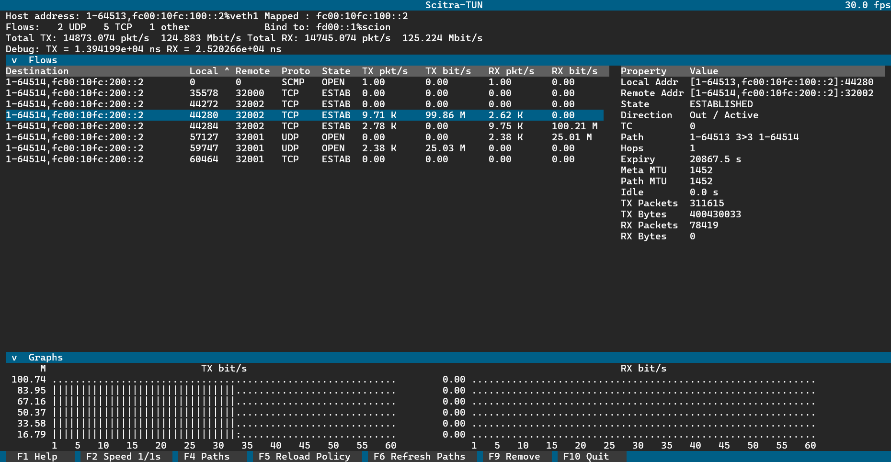

Scitra-TUN
==========
Scitra-TUN is a SCION-IP Translator for Linux. Creates a TUN device and sets up a route to capture
traffic addressed to the SCION-mapped IPv6 prefix fc00::/8. Communicates with border routers and
other SCION hosts via UDP socket that are dynamically created and destroyed.

Scitra-Tun can be used in any SCION AS with a UDP/IPv4 underlay. To use it with a UDP/IPv6 underlay,
the AS must be able to route SCION-mapped IPv6 addresses internally. SCION hosts using the
translator must have a SCION-mapped IPv6 address assigned to their public network interface that
encodes the ISD-ASN of their AS. This is easily achievable if your AS does not contain IP routers by
simply assigning the appropriate addresses to the interfaces with the `ip` command. If IP routers
are involved between SCION hosts and SCION border routers, you must create multiple SCION-mapped
IPv6 subnets with the same ISD-ASN and set up IPv6 routes between them.

Scitra-Tun requires `CAP_NET_ADMIN` to modify network interfaces. Capabilities
must be assigned manually by root after building the binary. e.g.
```bash
sudo setcap CAP_NET_ADMIN=ep build/scitra/Release/scitra-tun
```

Configuration
-------------

On a working SCION host, Scitra-TUN only requires a few options on the command line. There is no
configuration file except for defining path policies.

The configuration steps for using Scitra-TUN differ depending on whether your SCION AS uses a
UDP/IPv4 or UDP/IPv6 underlay for its internal communication. The IPv4 case is much simpler, so we
start there before we look at IPv6 ASes.

### SCION with a UDP/IPv4 Underlay ###

Prerequisites:
- A SCION daemon is running on the system. This is part of any standard SCION host. Its local
  address must be known (the default is 127.0.0.1:30255).
- The name of the network interface used for communication with SCION routers and other SCION hosts
  in the same AS. Usually this is the primary network interface of the host (eth0 or similar) but
  may be a different interface if SCION uses a separate layer 2 network or VLAN. Subsequently called
  the *public interface*.
- The local IPv4 addresses assigned to the public interface that is used to communicate with SCION
  routers and hosts. Often a private address, but can also be routable on the Internet. Subsequently
  called the *public address*.

Invoke Scitra-TUN as:
```bash
scitra-tun public_interface public_address -d daemon_address
```
Replace *public_interface*, *public_address*, and *daemon_address* with the items discussed in the
prerequisites. The daemon address may be omitted if it is the default of 127.0.0.1:30255 or
alternatively specified in the environment variable `SCION_DAEMON_ADDRESS`.

Scitra-TUN will create a TUN interface named `scion`, assign the SCION-mapped IPv6 representing the
local host and add a route for `fc00::/8` via interface `scion`.

### SCION with a UDP/IPv6 Underlay ###

Prerequisites:
- The SCION daemon and the same interface name and addresses as for the IPv4 underlay.
- The public address must be a SCION-mapped IPv6 address.
- A routable IPv6 address (e.g., a ULA) to assign to the translator's TUN interface. Can't be the
  same as the public address. This address is never used on the network, but is must have a unique
  prefix that is only routed to the TUN interface. I recommend `fd00::1`. This address is called the
  *TUN address*.

Invoke Scitra-TUN as:
```bash
scitra-tun public_interface public_address -a tun_address -d daemon_address
```

Scitra-TUN will create the TUN interface with the selected address and a route for `fc00::/8`. At
this stage the translator might already be working for destinations in remote addresses, but
additional route changes are necessary to complete the configuration. The issue is that there are
now two conflicting routes in the routing table, for example:
```bash
$ ip -6 route
fc00:10fc:100::/64 dev eth0 metric 1024 pref medium      # (1)
fc00::/8 dev scion proto static metric 1024 pref medium  # (2)
```
The first route (1) is for our public interface `eth0` and comes from the SCION-mapped IPv6 address
configured on that interface. The second route (2) was created by Scitra-TUN to funnel packets that
ought to be translated to SCION into the TUN interface. Together these routes create two problems:
1. Traffic to destinations in the same AS and same IP subnet (`fc00:10fc:100::/64` in the example)
is not translated as route (1) is preferred over route (2) as (1) has the longer prefix. This
behavior might be desirable as using SCION for AS-local communication incurs unnecessary overhead,
but will not work if the destination is a native SCION application.
2. More importantly, there is a routing loop if the destination is in the same AS as our host but in
a different subnet that is not directly connected. Since the underlay destination address of packets
after translation is still going to be from the `fc00::/8` subnet they are immediately routed back
into the translator instead of going out to the network. If the underlay destination is in the same
SCION subnet as our host, rule (1) matches and the loop is averted, otherwise packets enter a loop
until they become too big and are dropped.

To solve issue 2 we can employ source routing. Packets that originate from the public address used
by Scitra-TUN should be routed with a different routing table. We can set up a second routing table
as follows:
```bash
sudo ip route add fc00::/8 via fc00:10fc:100::1 dev eth0 table 1
```
Replace `fc00:10fc:100::1` with the IP of the gateway router in the SCION subnet. The example uses a
routing table at index `1`. Linux sets up the tables *default* (index 253), *main* (index 254), and
*local* (index 255) on boot. You can check how other tables are used (as far as the `ip` command is
concerned) by looking at `/etc/iproute2/rt_tables`. Check a tables contents with
`ip route show table n` where n is tha table index or name. Pick the index of an empty table for the
new route.

To use the new table, we can add a rule to the routing policy database like so
```bash
sudo ip -6 rule add from fc00:10fc:100::2/128 table 1
```
This causes packet with a source address of `fc00:10fc:100::2` to be routed according to table 1.
You should replace `fc00:10fc:100::2` with the the public address Scitra-TUN is configured with.
Now the routing loop is avoided.

We can address issue 1 by simply deleting the route for `fc00:10fc:100::/64` thus sending all
packets addressed to a SCION-mapped IP through the translator. If you do so, you probably want to
add the route back to the alternative routing table set up above to ensure directly connected
destinations are still reachable (via SCION only).
```bash
sudo ip route del fc00:10fc:100::/64 dev eth0 table main
sudo ip route add fc00:10fc:100::/64 dev eth0 table 1
```

**Important:** If the SCION control service and/or border routers use addresses from a `fc00::/8`
subnet, it must be ensured that there still is a route to reach them in the main routing table.
Hence, if you delete the route from the public interface, more specific routes for the SCION
services have to be added back in. For example, if the control service is at `fc00:10fc:100::1` you
can add a direct route to it with `sudo ip route add fc00:10fc:100::/128 dev eth0`. The same
principle applies to any other destination in the local AS that use SCION-mapped IPv6 address, but
should still be exempt from translation.

Changes to the routing tables may not be applied immediately, as the kernel maintains a routing
cache that may not get updated quickly. After changing the routes it is a good practice to flush the
cache with `sudo ip route flush cache`.

Port Forwarding
---------------

Scitra-TUN automatically opens SCION sockets for outgoing flows, but incoming flows are rejected by
default. To expose applications to the SCION network, their port(s) must be specified with the
`-p/--ports` option. Multiple ports should be separated by whitespace. There is no distinction
between UDP and TCP as the SCION underlay uses the same UDP port for both. Forwarded ports are known
as *persistent* in Scitra-TUN.

#### **Warning** ####
Scitra-TUN is not a firewall. Statically and dynamically allocated underlay sockets will forward all
incoming SCION packets irrespective of whether they belong to an existing flow or not. To prevent
hosts on the SCION network from accessing services on your machine, a separate firewall has to be
placed at the TUN interface created by Scitra-TUN and optionally also between the public network
interface and Scitra-TUN.

Note that, if Scitra-TUN is started with the `--dispatch` option all SCION traffic arriving at
underlay UDP port 30041 (known as the dispatcher or host port) is translated, even if the
destination port in the inner transport header differs from 30041. This behavior bypasses firewall
rules that filter by destination port that are placed between the SCION network and Scitra-TUN. To
properly filter destination ports, the firewall rules must be applied after translation at the TUN
interface.

Path Policy
-----------

Scitra-TUN accepts a set of traffic matchers and path policies in JSON format. The path to the
policy file is set with the `--policy` option.

Signals
-------

When Scitra-TUN receives `SIGHUP`, the path policies are reloaded from the the path specified in the
`--policy` option.

`SIGUSR1` cases Scitra-TUN to dump the state of all tracked flows to stdout.

Interactive User Interface
--------------------------



Start Scitra-TUN with the flag `--tui`. to see the interface depicted above. Press F1 to see a help
text. When using the TUI, it is recommended to redirect log output to a file by either redirecting
stderr or specifying a file name with the `-l/--log-file` option.

TODO
----

Read error queues of UDP sockets to forward errors to the TUN interface and use discovered MTU from
EMSGSIZE errors.
